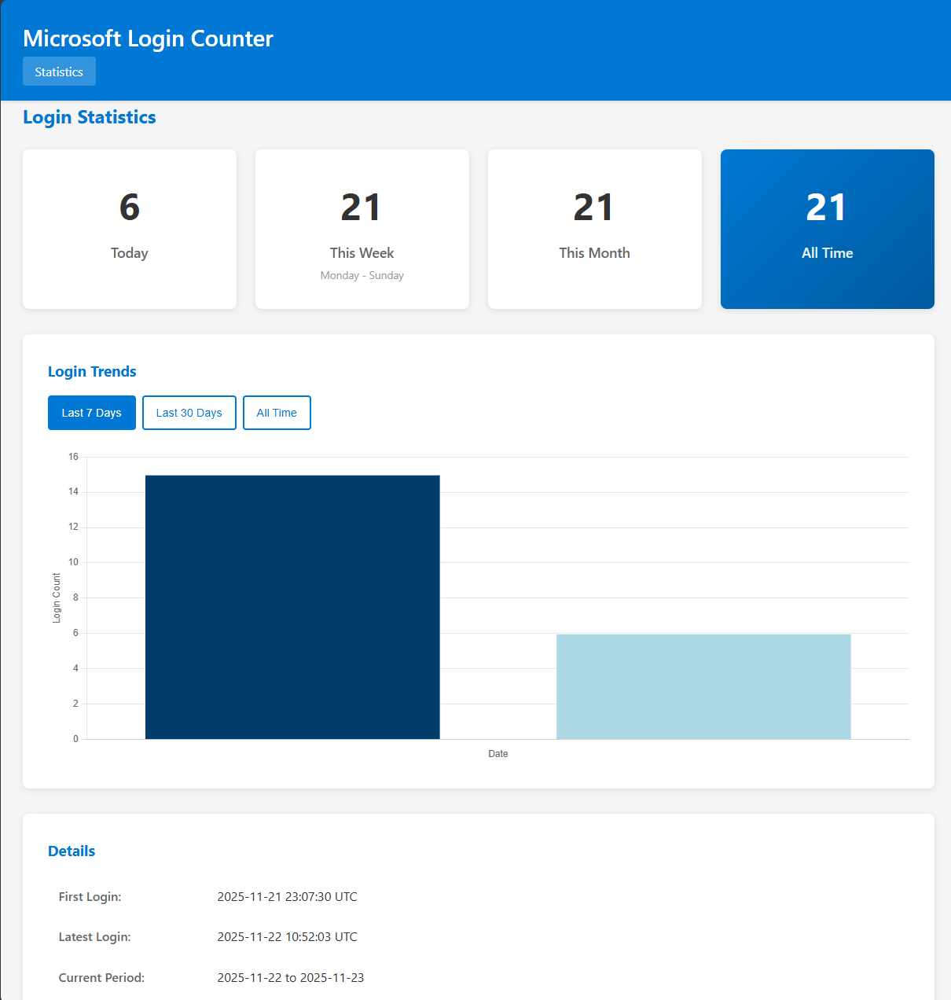

# Microsoft Login Event Counter

A local HTTP proxy that monitors network traffic to detect and count Microsoft authentication events without requiring browser extensions.

## Overview

This tool tracks how often you need to authenticate with Microsoft services by monitoring HTTP traffic patterns through a local proxy. It stores login events in a SQLite database and provides a web dashboard for viewing statistics.



## Features

- **Login Detection**: Automatically detects Microsoft authentication via HTTP metadata inspection
- **No Browser Extensions**: Works at the network level - no browser modifications required
- **Privacy-Focused**: No TLS decryption, monitors HTTP metadata only
- **Web Dashboard**: View today/week/month statistics and login history
- **Persistent Storage**: SQLite database survives proxy restarts

## Requirements

- Python 3.11+
- pip (Python package manager)

## Quick Start

See `specs/001-microsoft-login-counter/quickstart.md` for detailed setup instructions.

### Installation

```bash
# Create virtual environment
python3 -m venv venv
source venv/bin/activate  # On Windows: venv\Scripts\activate

# Install dependencies
pip install -r requirements.txt
```

### Configuration

Edit `config.yaml` to customize:
- Proxy port (default: 8080)
- Dashboard port (default: 8081)
- Database location
- Logging settings

### Running

```bash
# Start the proxy and dashboard
python src/main.py
```

Then configure your browser or system to use HTTP proxy `localhost:8080`.

Access the dashboard at: http://localhost:8081

## Architecture

- **Proxy**: mitmproxy-based HTTP proxy for traffic inspection
- **Storage**: SQLite database for login event persistence
- **Dashboard**: Flask web application for statistics display
- **Detection**: Pattern matching on HTTP CONNECT and OAuth callbacks

## Development

### Running Tests

```bash
# Run all tests
pytest

# Run specific test categories
pytest -m unit
pytest -m integration
pytest -m contract

# With coverage
pytest --cov=src --cov-report=html
```

### Project Structure

```
src/
├── proxy/          # mitmproxy addon and detection logic
├── storage/        # SQLite database and repository
├── dashboard/      # Flask web dashboard
├── config/         # Configuration loading
└── logging/        # Logging setup

tests/
├── contract/       # Contract tests for HTTP patterns
├── integration/    # Integration tests for full flows
└── unit/           # Unit tests for isolated components
```

## Documentation

- **Specification**: `specs/001-microsoft-login-counter/spec.md`
- **Implementation Plan**: `specs/001-microsoft-login-counter/plan.md`
- **Tasks**: `specs/001-microsoft-login-counter/tasks.md`
- **Data Model**: `specs/001-microsoft-login-counter/data-model.md`
- **API Contracts**: `specs/001-microsoft-login-counter/contracts/`

## License

[Add license information]

## Contributing

[Add contribution guidelines]
